# Nipe Architecture Diagrams

This document contains visual diagrams to help understand Nipe's architecture, data flow, and component interactions.

## Table of Contents

1. [Module Architecture](#module-architecture)
2. [Command Flow Diagrams](#command-flow-diagrams)
3. [Component Interaction](#component-interaction)
4. [Network Traffic Flow](#network-traffic-flow)
5. [IPTables Rules Structure](#iptables-rules-structure)

---

## Module Architecture

### Overall Module Structure

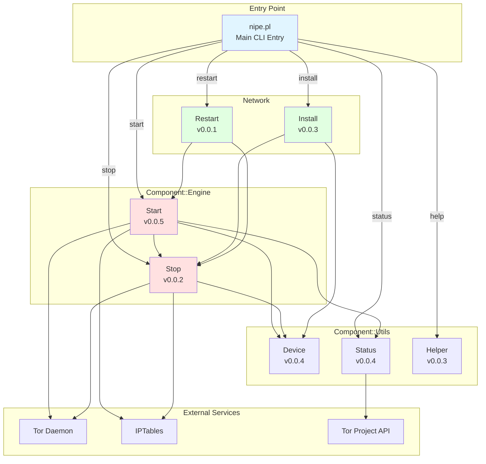

### Module Dependencies

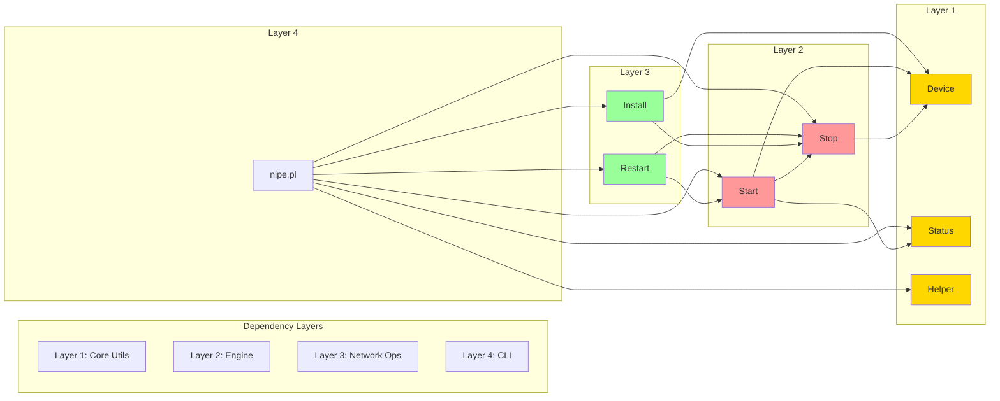

---

## Command Flow Diagrams

### Start Command Flow

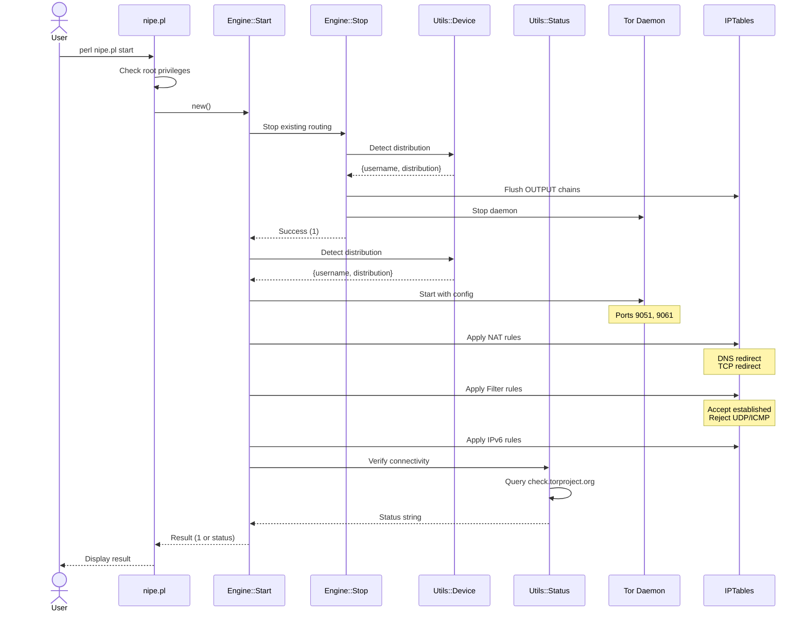

### Stop Command Flow

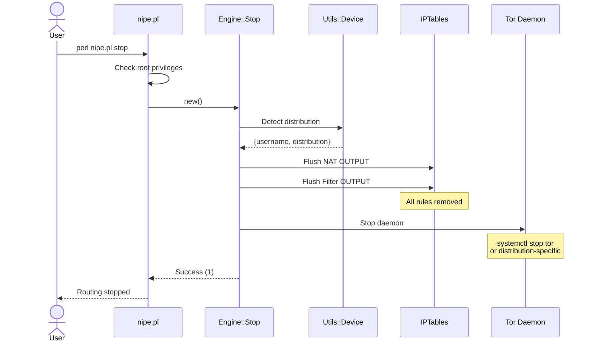

### Status Command Flow

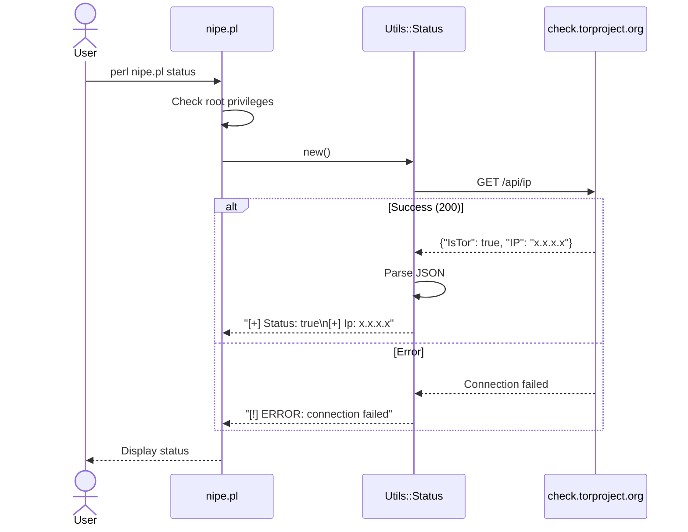

### Restart Command Flow

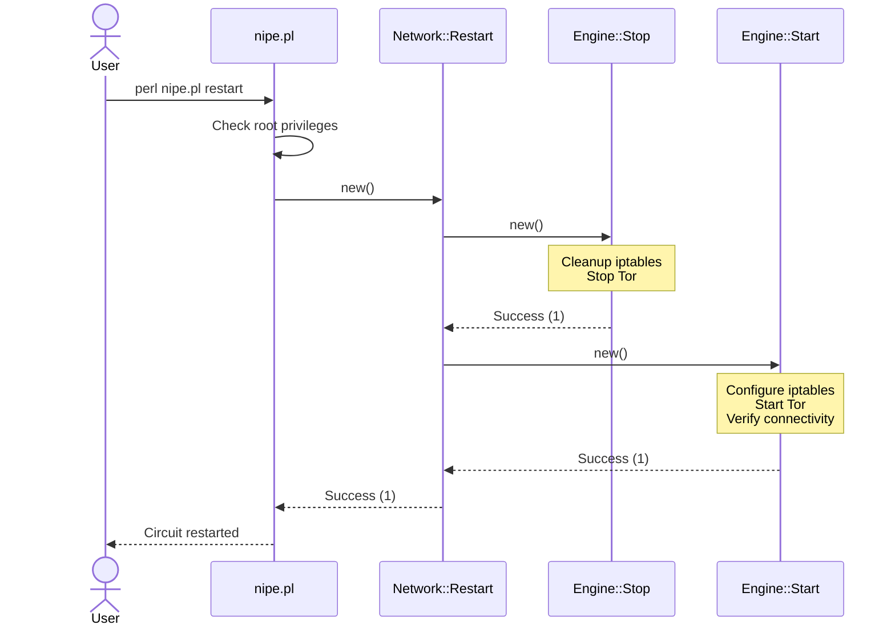

---

## Component Interaction

### System Component Diagram

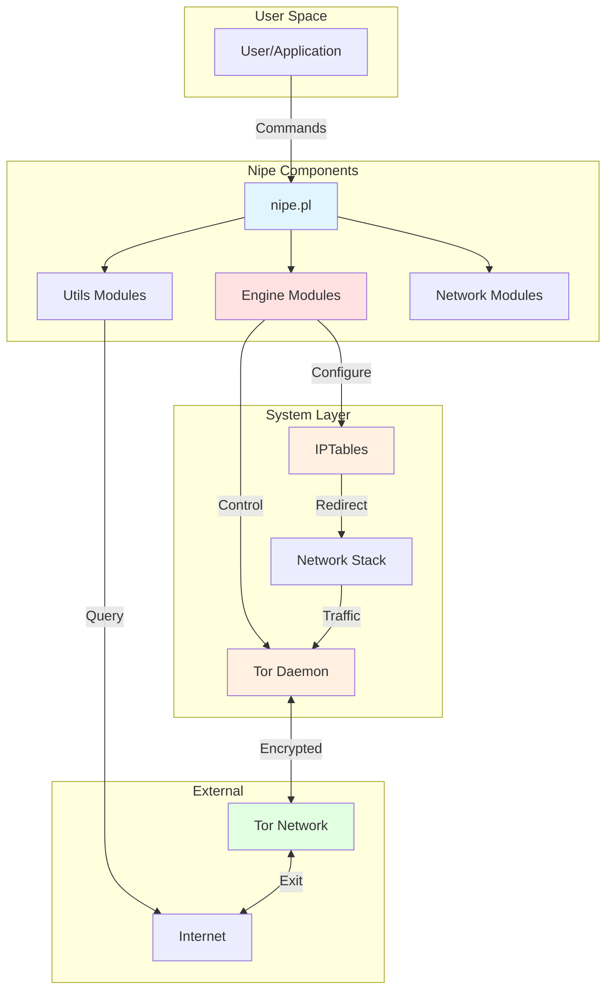

### Distribution Detection Flow

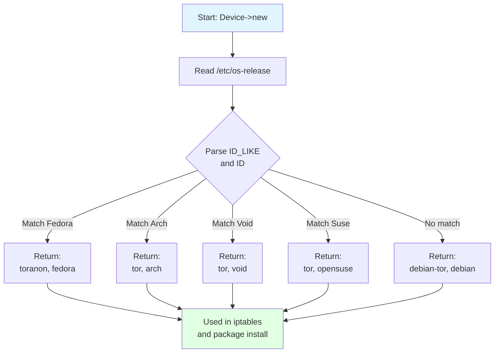

---

## Network Traffic Flow

### Normal Traffic vs Tor Traffic

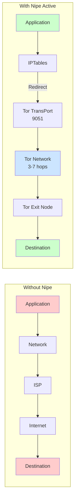

### Traffic Classification

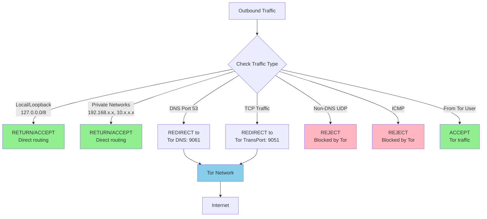

---

## IPTables Rules Structure

### NAT Table Rules

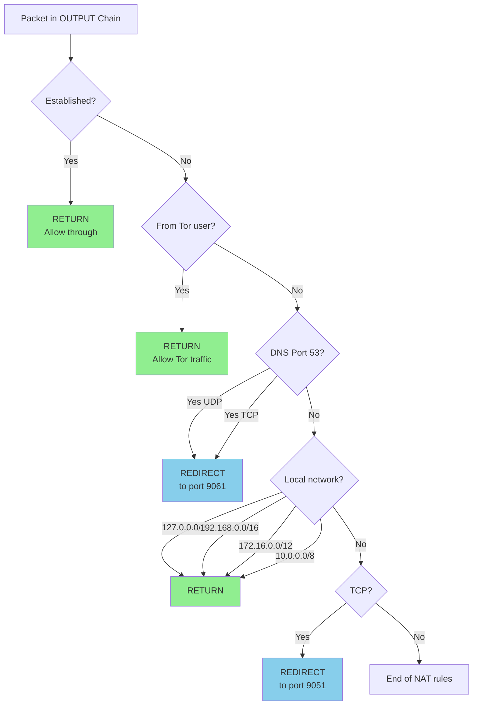

### Filter Table Rules

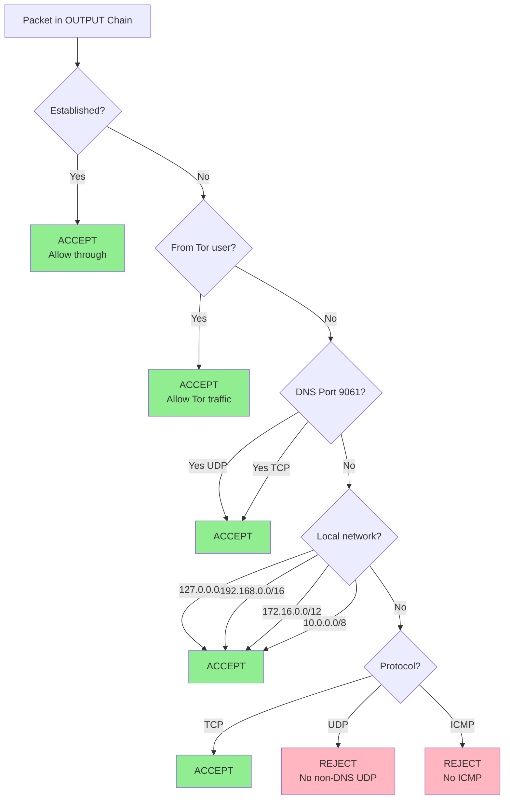

### Complete Rules Flow

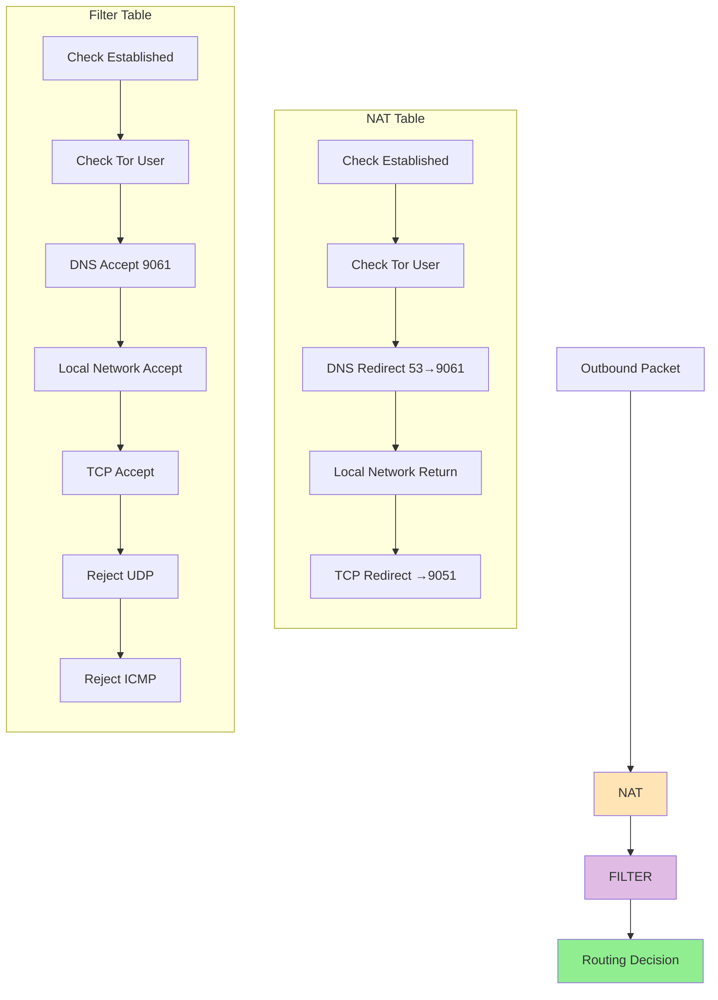

---

## Module Call Stack

### Start Command Call Stack

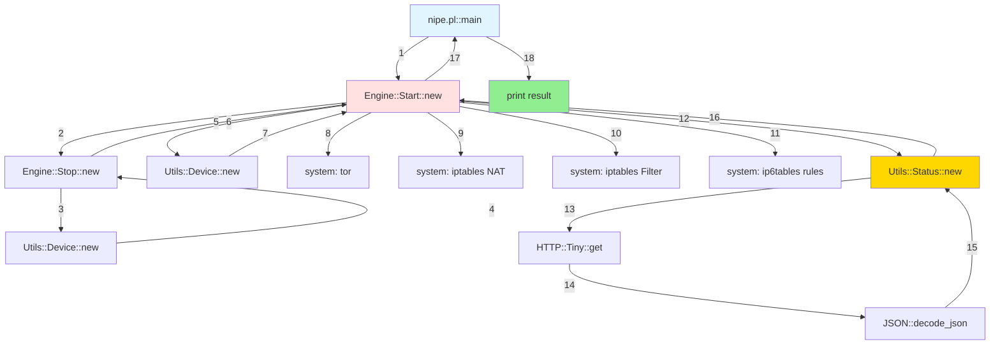

### Class Hierarchy

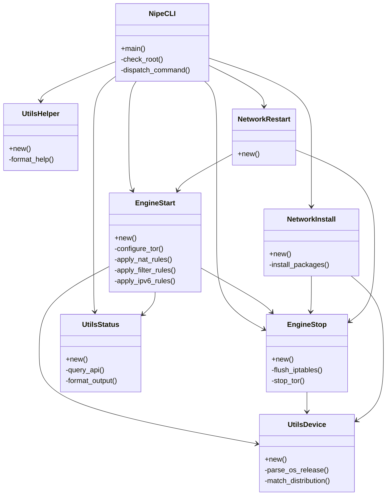

---

## Legend

### Diagram Colors

- 🔵 **Light Blue** - Entry points / CLI
- 🔴 **Light Red** - Engine modules (Start/Stop)
- 🟢 **Light Green** - Network modules (Install/Restart)
- 🟡 **Yellow** - Utility modules
- 🟠 **Orange** - External services (Tor, IPTables)

### Flow Direction

- ➡️ **Solid arrows** - Direct function calls
- ⤴️ **Dashed arrows** - Return values
- 🔄 **Bidirectional** - Interactive communication

---

## Using These Diagrams

These diagrams are rendered using Mermaid, which is natively supported by GitHub. To view them:

1. **On GitHub**: Diagrams render automatically in markdown preview
2. **Locally**: Use a Mermaid-compatible markdown viewer
3. **In IDE**: VS Code, IntelliJ with Mermaid plugins
4. **Export**: Use [Mermaid Live Editor](https://mermaid.live/) to export as PNG/SVG

## Updating Diagrams

When modifying the code:

1. Update relevant diagrams to reflect changes
2. Keep module versions in sync
3. Update flow diagrams if command logic changes
4. Add new components to architecture diagram
5. Test diagram rendering on GitHub

---

**Last Updated**: 2025-12-05
